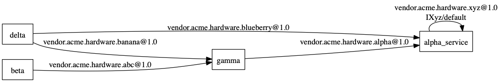

# hidl-visualizer
Python script that takes the output from 'ps -ef' and 'lshal' from a running Android target and produces a Graphviz dot source file with the dependencies between services and interfaces.

Note: This tool is mainly for the use of developing an Android device i.e. working with AOSP

Example usage:
<<<<<<< HEAD
=======
    
>>>>>>> Correct messy README file.
    adb shell lshal > lshal_example.txt
    adb shell ps -ef >> lshal_example.txt

    ./hidlizer.py -i lshal_example.txt -o lshal_example

